<p align="center">
  
</p>

<h1 align="center">MiGasto</h1>

<p align="center">
  <strong>Registra tus gastos e ingresos en el teléfono, sin escribirlos: lee tus pagos de Yape, Plin y Google Wallet.</strong><br>
  Pensada para quien paga casi todo con el celular en Perú. Todo se guarda solo en tu teléfono, en una base de datos cifrada: no hay servidor ni cuenta.
</p>

<p align="center">
  <a href="https://flutter.dev"></a>
  <a href="https://dart.dev"></a>
  <a href="https://kotlinlang.org"></a>
  
  
  
  
</p>

---

## 📱 Capturas de Pantalla (Preview)

> Capturas tomadas en un emulador Android (Google Pixel) con la versión *release* de MiGasto. Los nombres y montos son **datos de ejemplo**.

### Inicio y Resumen

| 01. Bienvenida | 02. Resumen | 03. Montos ocultos | 04. Movimientos |
| :---: | :---: | :---: | :---: |
| 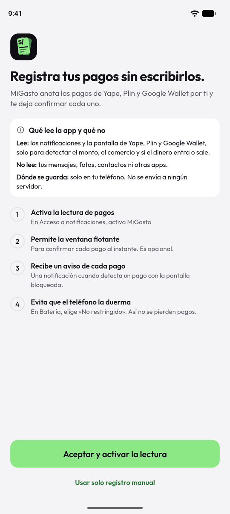 | 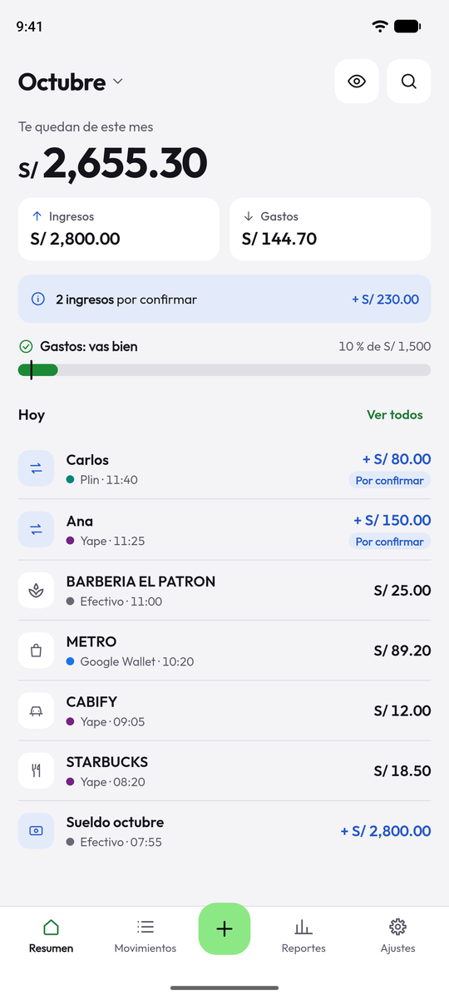 | 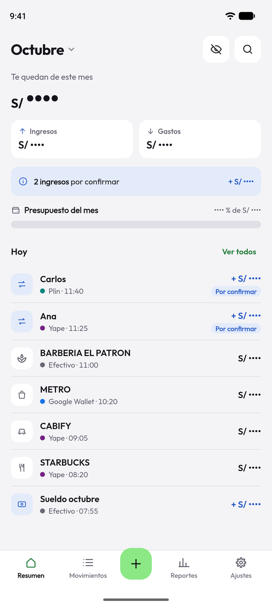 | 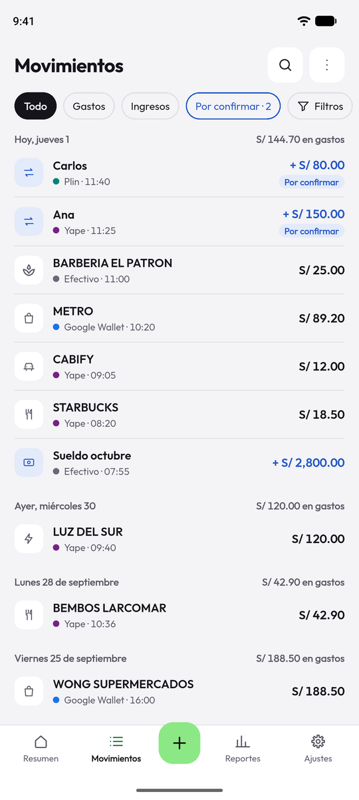 |
| *Qué lee la app y qué no,*<br>*y los permisos paso a paso* | *Saldo del mes, ingresos y gastos,*<br>*presupuesto y movimientos de hoy* | *El ojo oculta todos los montos;*<br>*al mostrarlos, el saldo cuenta desde 0* | *Agrupados por día, con alias,*<br>*íconos y fuente de cada pago* |

### Filtros, Reportes y Registro

| 05. Filtros | 06. Reportes | 07. Detalle | 08. Registro manual |
| :---: | :---: | :---: | :---: |
| 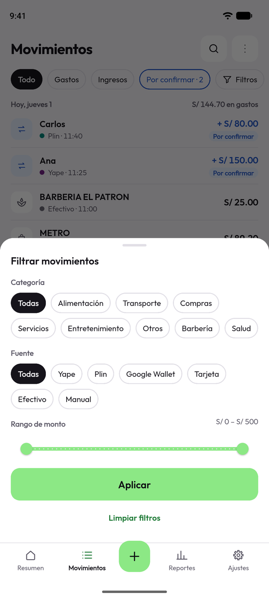 | 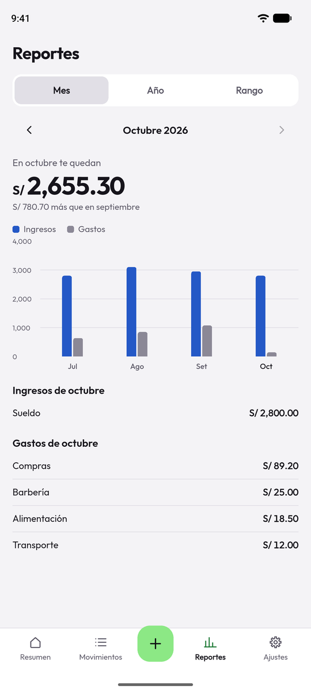 | 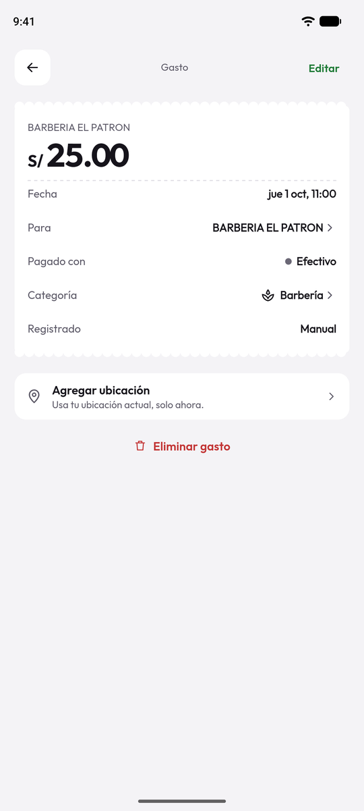 | 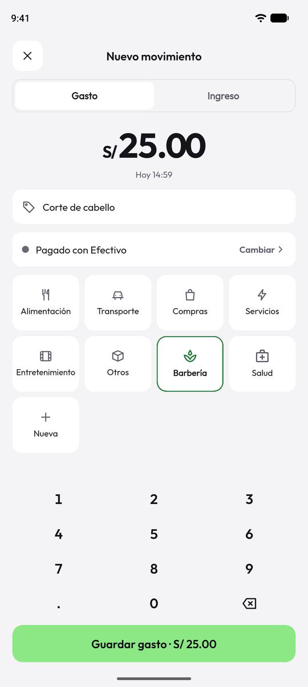 |
| *Por categoría (incluidas las*<br>*propias), fuente y rango de monto* | *Ingresos frente a gastos por mes*<br>*y tablas por categoría* | *Boleta con fecha, fuente,*<br>*categoría y ubicación opcional* | *Teclado numérico propio y*<br>*categorías, también las tuyas* |

### Categorías Propias y Lectura de Pagos

| 09. Nueva categoría | 10. Mis categorías | 11. Ventana flotante | 12. Aviso con botones |
| :---: | :---: | :---: | :---: |
| 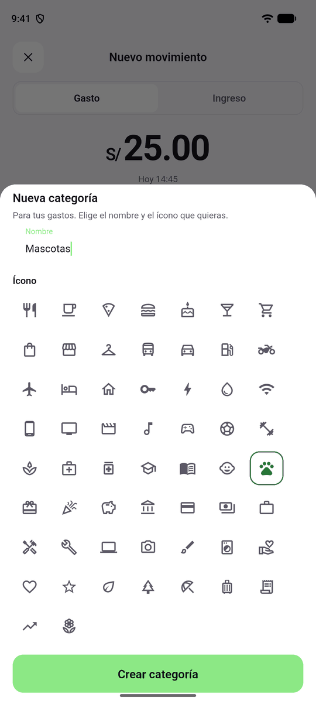 | 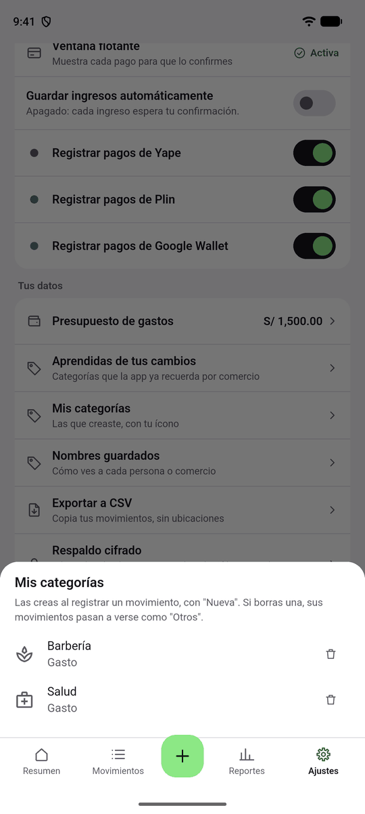 | 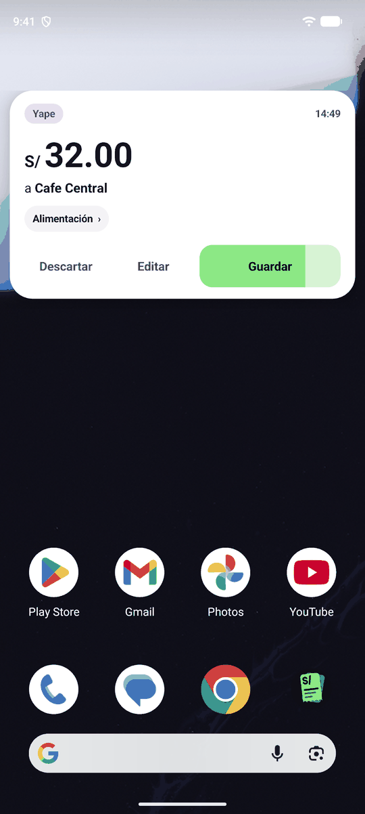 | 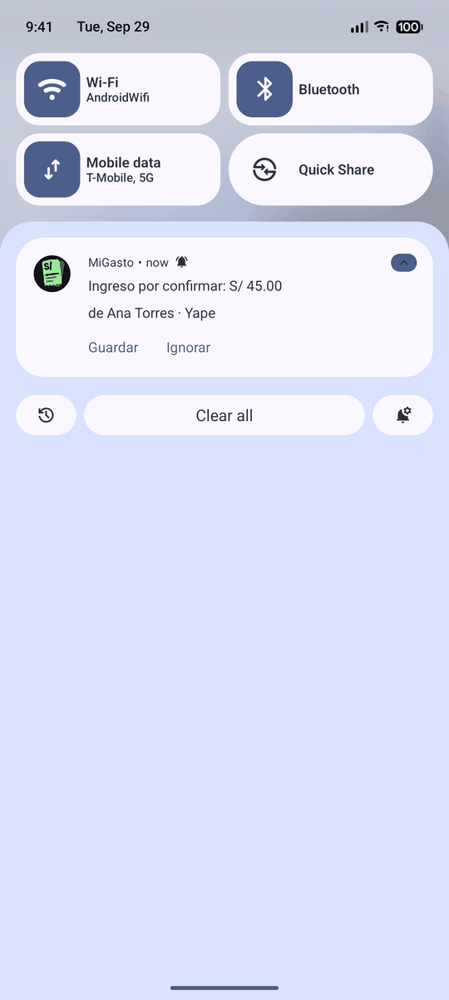 |
| *Nombre y el ícono que quieras,*<br>*entre 56 disponibles* | *Las que creaste; si borras una,*<br>*sus movimientos pasan a «Otros»* | *Sobre cualquier app, con la cuenta*<br>*regresiva dentro de «Guardar»* | *Con la pantalla bloqueada: guarda o*<br>*ignora un ingreso sin abrir la app* |

### Ajustes, Respaldo y Modo Oscuro

| 13. Ajustes | 14. Respaldo | 15. Modo oscuro | 16. Reportes oscuro |
| :---: | :---: | :---: | :---: |
| 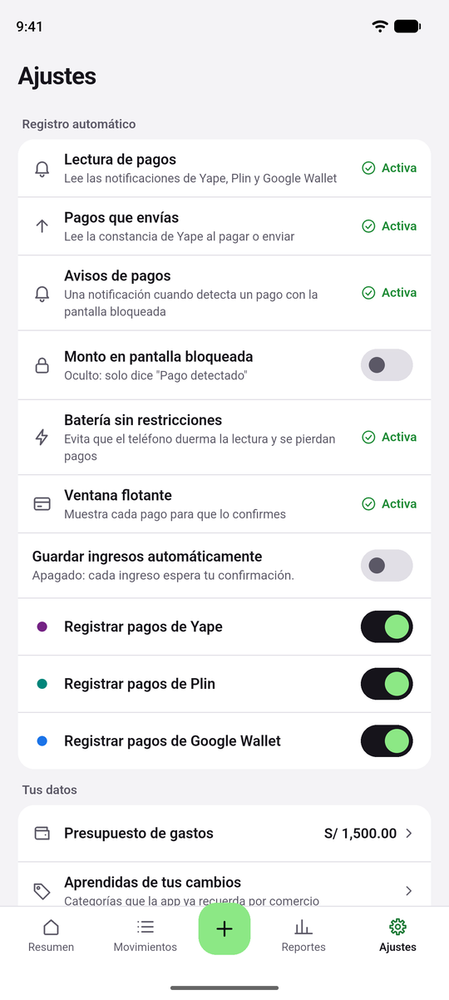 | 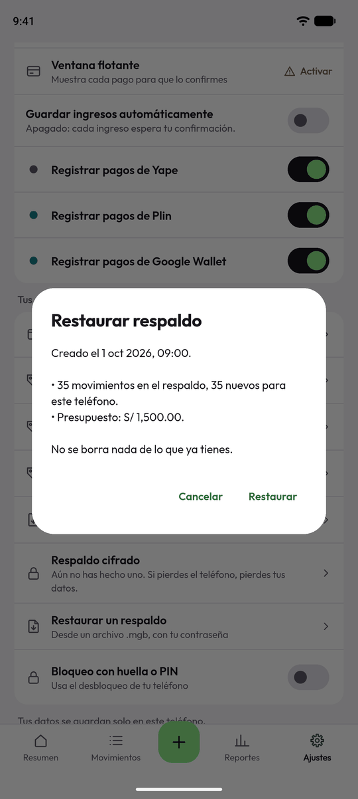 | 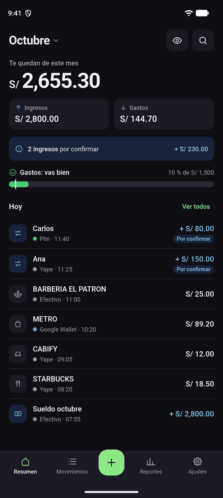 | 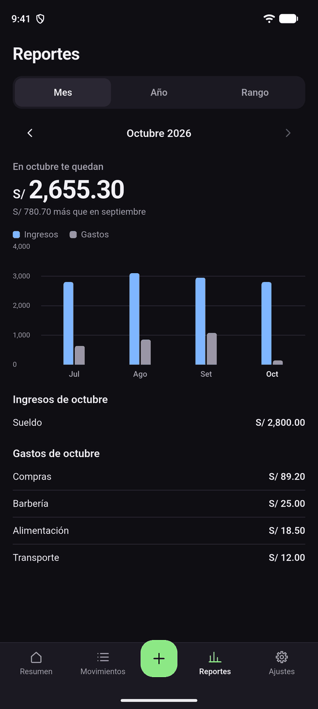 |
| *Estado de cada permiso, fuentes*<br>*a registrar y guardado automático* | *Archivo .mgb cifrado con tu*<br>*contraseña; no borra lo que ya tienes* | *Claro u oscuro según el sistema,*<br>*con la misma jerarquía visual* | *Barras de ingresos y gastos y*<br>*detalle por categoría* |

---

## ⚡ Características Principales

- **💸 Gastos e ingresos.**
  - Los gastos se guardan solos. Los ingresos esperan tu confirmación y, si los ignoras, quedan en «Por confirmar».
  - En Ajustes puedes activar **Guardar ingresos automáticamente** (apagado por defecto).
- **📲 Detección en Android.** Dos fuentes, ambas nativas (Kotlin):
  - **Acceso a notificaciones** (`PaymentNotificationListener`): lo que recibes (por ejemplo, «te envió un pago por S/ 5»). Es la vía principal.
  - **Accesibilidad** (`MyAccessibilityService`): la constancia de Yape cuando envías o pagas («¡Yapeaste!»), porque Yape no avisa al que paga. Es opcional; se activa en Ajustes > «Pagos que envías». De la pantalla **solo** se lee la constancia (la que trae «DATOS DE LA TRANSACCIÓN»): el inicio de Yape, con el saldo y los últimos movimientos, se ignora.
  - Ambas pasan por el mismo lector de reglas y la misma protección contra duplicados.
- **🎈 Ventana flotante.** Aparece sobre cualquier app con el monto, el comercio, la fuente y la categoría. El botón **Guardar** es la cuenta regresiva: se vacía de color fuerte a tenue en 4 segundos y guarda al terminar; tocar la ventana la pausa; deslizarla hacia arriba la descarta. Un ingreso espera tu confirmación, salvo que hayas activado el guardado automático.
- **🔔 Notificación de cada pago.** Cuando la ventana flotante no se puede ver (pantalla apagada o bloqueada, o sin el permiso «Mostrar sobre otras apps») MiGasto guarda el pago según las reglas de siempre y te avisa con una notificación local (no hay servidor ni *push*):
  - un gasto queda guardado y avisa en silencio («Gasto guardado: S/ 3.00 · a Michael · Yape»);
  - un ingreso que espera confirmación avisa con sonido y trae los botones **Guardar** e **Ignorar** para resolverlo sin abrir la app (se ven al desbloquear y bajar la barra; en la pantalla bloqueada no, por privacidad);
  - en la pantalla bloqueada solo dice «Pago detectado», salvo que actives Ajustes > «Monto en pantalla bloqueada»;
  - con el teléfono en uso y desbloqueado sigue saliendo la ventana flotante, sin duplicar el aviso. Android 13 o más pide el permiso de notificaciones.
- **🛡️ Avisos de permisos y batería.** Un aviso en Resumen cuando el acceso a notificaciones está apagado (no se ve ningún pago) y otro cuando la batería de la app está restringida (el teléfono puede dormir la lectura; en Samsung se elige «No restringido»). El de batería se puede posponer 7 días. Ajustes tiene su fila de estado y el onboarding un paso. Al abrir la app se le pide al sistema que reconecte el lector de notificaciones si lo soltó.
- **🧩 Reglas compartidas.** Qué es un pago y de qué categoría es se define en `assets/reader_rules.json` y `assets/category_rules.json`, que leen Kotlin y Dart. Si un banco cambia su texto, se actualiza el JSON.
- **♻️ Sin duplicados.**
  - Un mismo pago que llega por dos vías (la notificación y la pantalla de la constancia, o la accesibilidad y el acceso a notificaciones) cuenta una sola vez: mismo monto, fuente y tipo dentro de 2 minutos **por vías distintas**.
  - Dos yapes iguales seguidos valen los dos, porque cada notificación se identifica por sí sola.
  - Una notificación ya leída no se vuelve a procesar aunque el sistema la reenvíe al reiniciar el servicio o reinstalar la app.
  - Una constancia de Yape ya leída tampoco se repite, aunque el servicio se reinicie con ella abierta: se reconoce por su número de operación o, si no está a la vista, por su fecha y hora.
  - Los descartes quedan anotados en el registro de Android (`logcat`) con su razón.
- **🏷️ Nombres (alias).** En un movimiento, toca «De» o «Para» para ponerle un nombre corto a esa persona o comercio («Michael» en vez de «MICHAEL ANTHONY VALDIVIEZO MAZA»). Se aplica a todos los movimientos de ese nombre, en Resumen, Movimientos, el detalle, el mapa y la ventana flotante, y la búsqueda encuentra por el nombre nuevo o por el original. El pago guarda siempre el nombre original; el alias solo cambia cómo se ve. Se administran en Ajustes > Nombres guardados y viajan en el respaldo cifrado.
- **🗂️ Categorías.** Por palabras clave (no es IA) y por lo que cambias a mano («Aprendidas de tus cambios»).
- **🎨 Categorías propias.** Al registrar un movimiento (o al cambiar su categoría) toca **Nueva** y elige un nombre y un ícono entre 56. Se ven igual que las demás en Resumen, Movimientos, el detalle, los filtros, Reportes y el CSV. Se administran en Ajustes > Mis categorías y viajan en el respaldo cifrado. Cuentan como Otros / Otros ingresos para los totales y las reglas, así que borrar una no deja movimientos huérfanos.
- **👁️ Ocultar y ver los montos.** El ojo de Resumen oculta el saldo, Ingresos, Gastos, el presupuesto y los montos de Movimientos, Reportes y el detalle (`S/ ••••`). Al volver a mostrarlos, el saldo sube contando desde 0. Se recuerda entre aperturas.
- **📊 Resumen, Movimientos y Reportes.** Saldo del mes, presupuesto de gastos con estado en texto, filtros por tipo, fuente, categoría y monto, e ingresos frente a gastos por mes.
- **📍 Ubicación opcional.** Se pide solo al tocar «Agregar ubicación» y con la app en uso. Muestra la dirección y un mapa de Google Maps; puedes quitarla de un movimiento o borrar todas.
- **🍎 iPhone.** Acción de Atajos «Registrar movimiento» para Apple Pay y extensión para compartir capturas de Yape y Plin, con lectura de texto en el teléfono (Vision).
- **🔐 Datos cifrados.** SQLite con cifrado (SQLite3MultipleCiphers). La clave se genera en el teléfono y vive en el almacén seguro del sistema (Keychain en iPhone, Keystore en Android). Huella, rostro o PIN del teléfono para el bloqueo.
- **💾 Respaldo cifrado.** Ajustes > Respaldo cifrado crea un archivo `.mgb` con tus movimientos (con ubicaciones y texto original), tu presupuesto, las categorías aprendidas, los nombres guardados y tus categorías propias, cifrado con **AES-256-GCM** y una clave derivada de tu contraseña con PBKDF2-SHA256 (210 000 vueltas). Lo compartes donde quieras (Drive, correo, tu computadora). MiGasto no guarda la contraseña: si la olvidas, el respaldo no se puede abrir. Ajustes > Restaurar un respaldo lo abre y **agrega lo que falta sin borrar nada** (los movimientos que ya están, por id, no se duplican). Una contraseña equivocada o un archivo alterado se detectan.
- **📤 Exportar a CSV** (sin ubicaciones).
- **🌗 Claro y oscuro** según el sistema. Tipografía Outfit, que la app descarga la primera vez que hay internet (sin conexión usa la del sistema).

---

## 🏗️ Arquitectura y Tecnologías

Flutter 3.47 (Dart 3.13), Riverpod, GoRouter, Drift (SQLite cifrado), fl_chart, percent_indicator, google_maps_flutter, geolocator, geocoding, local_auth, flutter_svg, cryptography (respaldo), share_plus y file_picker. La detección en Android vive en la capa nativa (Kotlin) y Flutter es el **único que escribe en la base de datos**: lo nativo deja los pagos en una cola y Flutter la vacía.

```text
MiGasto/
├── lib/
│   ├── main.dart                      # Arranque, tema y rutas
│   ├── core/                          # Tema (tokens y colores), navegación y configuración
│   ├── data/
│   │   ├── datasource/                # Base SQLite cifrada con Drift y su administrador
│   │   ├── repositories/              # Repositorio de movimientos, alias y ajustes
│   │   └── services/                  # Lector de pagos, clasificador, respaldo, ubicación
│   ├── domain/                        # Movimiento, categorías propias, alias, duplicados, avisos de ajuste
│   ├── presentation/
│   │   ├── dashboard/                 # Resumen (saldo, presupuesto, avisos)
│   │   ├── expenses/                  # Movimientos, detalle, registro manual, categorías, mapa
│   │   ├── reports/                   # Reportes por mes, año y rango
│   │   ├── settings/                  # Ajustes, respaldo y restauración
│   │   ├── onboarding/ lock/ setup/   # Bienvenida, bloqueo con huella o PIN, guía de Apple Pay
│   │   └── providers.dart             # Estado con Riverpod y puente con lo nativo
│   └── shared/                        # Widgets (íconos, montos, filas), formato y CSV
├── assets/
│   ├── reader_rules.json              # Qué es un pago (Yape, Plin, Wallet), compartido con Kotlin
│   ├── category_rules.json            # Categorías por palabras clave, compartido con Kotlin
│   └── brand/icon.svg                 # Logo
├── android/app/src/
│   ├── main/kotlin/com/example/mi_gasto/   # Capa nativa de Android (ver abajo)
│   └── test/                          # Pruebas JUnit del código nativo
├── ios/
│   ├── Runner/                        # Atajos (Registrar movimiento) y cola por App Group
│   ├── ShareExtension/                # Compartir capturas de Yape y Plin (lectura con Vision)
│   └── WidgetExtension/               # Widget y control del Centro de control
├── test/                              # Pruebas de Flutter
└── docs/                              # Política de privacidad, notas de publicación y capturas
```

---

## 🎈 Capa Nativa de Android (Kotlin)

Ubicada en `android/app/src/main/kotlin/com/example/mi_gasto/`:

1. **`PaymentNotificationListener`:** servicio de acceso a notificaciones. Solo mira las apps de pago (Yape, Wallet y las de los bancos), ignora las antiguas (más de 3 minutos) o ya leídas, y pasa el texto al lector. Es la vía principal.
2. **`MyAccessibilityService`:** lee la pantalla de **constancia** de Yape (al enviar o pagar). Contiene el flujo común `handleText` → lector de reglas → filtros de duplicados → entrega.
3. **`ReaderRules`:** lee `assets/reader_rules.json` y `assets/category_rules.json`: monto, tipo (gasto o ingreso), nombre de la persona o comercio, número de operación, fecha de la constancia y categoría.
4. **`DuplicateGuard` y `HandledStore`:** el primero decide si un pago es el mismo que llegó por otra vía (solo entre vías distintas); el segundo guarda en el teléfono lo ya leído (notificaciones y constancias) para sobrevivir a reinicios.
5. **`OverlayService`:** la ventana flotante (`TYPE_APPLICATION_OVERLAY`) con la cuenta regresiva dentro de «Guardar», chips de categoría, gesto para descartar y animaciones.
6. **`PaymentNotifier` y `PaymentActionReceiver`:** el aviso local cuando no se ve la ventana (canal con sonido para ingresos por confirmar, canal silencioso para gastos) y los botones **Guardar** / **Ignorar**, que dejan la orden en la cola.
7. **`NativeQueue`:** la cola (en `SharedPreferences`) donde lo nativo deja pagos y órdenes; Flutter la vacía al abrir la app, al volver a ella y cada vez que se guarda algo, así no se pierde nada aunque la app esté cerrada.
8. **`MainActivity`:** el canal con Flutter (permisos, estado de batería, reconexión del lector).

---

## 🚀 Comenzando

### Requisitos Previos

- **Flutter 3.47** o superior (con `fvm`: `fvm install 3.47.5`).
- **Android:** Android Studio con el SDK de Android y un teléfono o emulador con Android 7.0 (API 24) o superior.
- **iPhone:** Xcode (solo en macOS). En iPhone Yape y Plin no se leen solos; ver «Lo que todavía no hace».

### 1. Clonar el repositorio

```bash
git clone https://github.com/VMichael1999/MiGasto.git
cd MiGasto
```

### 2. Variables de entorno

Copia `.env.example` a `.env` y completa tu clave de Google Maps. El `.env` no se sube al repositorio.

```bash
cp .env.example .env
```

```env
GOOGLE_MAPS_API_KEY=tu_clave_de_google_maps_aqui
```

La clave también la leen Android (al compilar, desde `.env`) e iOS (por `xcconfig`). En Google Cloud conviene restringirla por app (ID de paquete y bundle ID) y a la API de Maps SDK. Sin clave la app funciona igual; solo el mapa del detalle no se muestra.

### 3. Instalar dependencias

```bash
flutter pub get
```

---

## 💻 Ejecución del Proyecto

### Ejecutar en el teléfono o emulador

Pasa el `.env` para que el mapa funcione:

```bash
flutter run --dart-define-from-file=.env
```

### Compilar la versión *release* para Android

```bash
flutter build apk --release
adb install -r build/app/outputs/flutter-apk/app-release.apk
```

---

## 🧪 Pruebas y Calidad de Código

### 1. Pruebas de Flutter y análisis

```bash
flutter analyze
flutter test
```

Hay 118 pruebas: cifrado de la base, lector (gasto o ingreso, montos, textos que no son pagos, y los textos reales de la notificación y la constancia de Yape), categorías y categorías propias, duplicados, migración de datos antiguos, cola nativa (incluidos los botones del aviso), ventana de pago, guardado automático de ingresos, registro manual, ocultar montos, respaldo, ubicación y bloqueo.

### 2. Pruebas nativas de Android (JUnit)

9 pruebas del freno de duplicados (`DuplicateGuard`): dos yapes seguidos del mismo monto, notificación más constancia en ambos órdenes, accesibilidad más notificación, la ventana de tiempo, y otro monto, tipo o fuente.

```bash
cd android && ./gradlew :app:testDebugUnitTest
```

(`android/gradlew` lo genera Flutter en la primera compilación: corre antes `flutter build apk` o `flutter run`.)

El resto de lo nativo (lector de reglas, servicio de notificaciones, accesibilidad, ventana flotante y avisos) se verificó a mano en teléfonos reales y en un emulador.

### Estado de las pruebas

```text
Flutter:  118 passed, 0 failed
JUnit:      9 passed, 0 failed
Análisis: sin problemas
```

---

## 🔑 Permisos en Android

- **Acceso a notificaciones:** para leer los avisos de Yape, Plin y Google Wallet. Solo esas apps (lista en `PaymentNotificationListener`); el resto se ignora.
- **Accesibilidad (opcional):** para leer la constancia de Yape cuando envías o pagas. Solo escucha esas apps (`accessibility_service_config.xml`).
- **Mostrar sobre otras apps (opcional):** para la ventana flotante. Sin ella, los pagos quedan «Por confirmar» en la app.
- **Estado de la batería** (sin permiso extra): solo se consulta si la app está restringida y se abre su ficha de ajustes para que tú lo cambies.
- **Notificaciones (Android 13 o más):** para avisarte de cada pago detectado cuando la ventana flotante no se puede ver.
- **Vibración:** una vibración corta cuando aparece la ventana.
- **Ubicación (solo en uso):** únicamente cuando tocas «Agregar ubicación».

La app explica qué lee y qué no antes de pedir cualquier permiso, y se puede usar solo con registro manual. Android puede marcar «Configuración restringida» al instalar fuera de Play Store: se permite desde Ajustes > Aplicaciones > MiGasto.

---

## 📌 Guía de Uso (probar la lectura de pagos)

Para ver el flujo completo sin hacer un pago real, en una versión de **depuración** (`flutter run`):

1. **Onboarding:** acepta y activa la lectura, o elige «Usar solo registro manual».
2. **Permisos:** en Ajustes activa «Lectura de pagos» (Acceso a notificaciones) y, si quieres, «Ventana flotante», «Pagos que envías» y «Avisos de pagos».
3. **Probar la lectura:** al final de Ajustes, en **Solo desarrollo**, escribe un texto como el de una notificación (por ejemplo `Yapeaste S/ 18.50 a Starbucks` o `Ana Torres te yapeó S/ 45.00`) y toca **Probar**. Pasa por el mismo camino que un pago real.
4. **Segundo plano:** minimiza la app y repite: verás la **ventana flotante** (o, con la pantalla bloqueada, la **notificación**). Un gasto se guarda solo a los 4 segundos; un ingreso espera tu confirmación (botón **Guardar** o **Ignorar**).
5. **Respaldo:** en Ajustes crea un respaldo cifrado y restáuralo para ver cómo no se duplica lo que ya tienes.

---

## 🚧 Lo que todavía no hace

- **iPhone:** Yape y Plin no se detectan solos (iOS no lo permite). Se registran compartiendo la captura de la constancia a MiGasto (el texto se lee en el teléfono) o con el botón +. Los pagos con Apple Pay en el POS se registran con la automatización Transacción de Atajos. Hay un widget y un control del Centro de control que abren el registro (`migasto://new`).
- **Validado con un teléfono real (Samsung, Yape):** pago recibido (notificación), yape enviado y pago de un servicio (constancia: la empresa es el nombre y cae en la categoría Servicios). **Sin validar:** Google Wallet y Plin dentro de las apps de BBVA, Interbank y Scotiabank; los nombres de paquete de esos bancos son suposiciones y el texto exacto de cada notificación falta confirmarlo (fase 0 del plan).
- **Android:** en algunos teléfonos Samsung el servicio de Accesibilidad no recibe los avisos de notificación; por eso se usa el acceso a notificaciones.
- **Respaldo:** es manual; no hay copia automática ni en la nube. Hay que acordarse de crearlo. En Android la copia automática de Google y la transferencia entre teléfonos están desactivadas a propósito (`allowBackup="false"`): la clave de la base no viaja, así que una copia restaurada no se podría abrir. Para pasar tus datos a otro teléfono usa el respaldo cifrado.
- **Ventana flotante de Android:** todavía no ofrece tus categorías propias (solo las de siempre), y la app no aprende una categoría propia para los pagos futuros de un comercio (solo la aplica a los anteriores si lo pides).
- **Ubicación automática al pagar** con Apple Pay (iPhone) y desde la ventana flotante de Android.

Para publicar en las tiendas faltan además un identificador de app propio, la firma de *release* y la clave de Maps restringida; ver [`docs/publicacion.md`](docs/publicacion.md). La [política de privacidad](docs/politica-de-privacidad.md) explica qué datos usa la app.

---

## 👥 Contribución y Créditos

Desarrollado por **Michael Anthony**.

- **Repositorio:** [VMichael1999/MiGasto](https://github.com/VMichael1999/MiGasto)
- **Rama principal:** `main`

---

<p align="center">
  <b>MiGasto</b> · Tus pagos, anotados solos 💚
</p>
